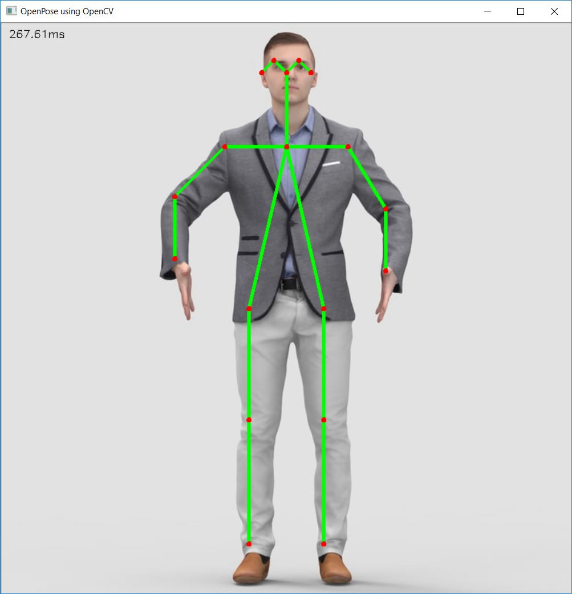

WorkOutApp README
Overview
WorkOutApp is a fitness application designed to help users track their exercise routines, monitor their progress, and maintain a healthy lifestyle. This README provides an overview of the key components and functionalities of the app.

Key Activities
1. BMIActivity.kt
This activity is responsible for calculating and displaying the user's Body Mass Index (BMI) based on their height and weight inputs.
2. Constants.kt
Contains constant values used throughout the app, ensuring consistency and ease of maintenance.
4. ExerciseModel.kt
Defines the data  for exercises, providing a structured way to represent exercise information.
5. ExerciseStatusAdapter.kt
An adapter for displaying exercise status, facilitating the visualization of exercise progress and completion.
6. FinishActivity.kt
This activity is responsible for summarizing an exercise session.
7. HistoryActivity.kt
Allows users to view their exercise history, including details about past workouts and statistics.
8. HistoryAdapter.kt
An adapter for displaying exercise history items, making it easy for users to browse their past workouts.
9. HistoryDao.kt
Provides data access methods for interacting with the local database, including operations for storing and retrieving exercise history.
10. HistoryDatabase.kt
Defines the local database structure for storing exercise history data.
11. HistoryEntity.kt
Defines the data structure (entity) for storing exercise history records in the local database.
12. MainActivity.kt
The main entry point of the app, displaying the primary navigation and user options.
13. WorkOutApp.kt
The main application class that initializes various components and configurations for the WorkOutApp.
Features
BMI Calculator: Calculate and monitor your BMI to keep track of your overall health.
Exercise History: View your exercise history to track your progress over time.
User-Friendly Interface: The app features an intuitive and user-friendly interface for ease of use.
Getting Started
To run WorkOutApp on your device, follow these steps:

Clone the repository to your local machine.

Open the project in Android Studio.

Build and run the app on your Android device or emulator.

Dependencies
WorkOutApp relies on the following libraries and frameworks:

Android Jetpack components
SQLite for local data storage
RecyclerView for displaying lists of exercises and history items
Contributions
We welcome contributions from the community to enhance the WorkOutApp. If you have ideas for improvements or would like to report issues, please feel free to open an issue or submit a pull request.

# PoseNet Position Detection

## Introduction

This repository contains a PoseNet-based position detection project for tracking body poses in images or video. PoseNet is a machine learning model that can estimate human poses in real-time. This project utilizes PoseNet to detect key body positions and provide insights into body posture during various activities.

## Use of Position Tracker in Yoga/Exercise

The PoseNet position tracker can be employed in yoga and exercise routines to monitor and analyze body positions. By leveraging the capabilities of PoseNet, this tool helps users:

- Ensure correct posture during yoga sessions.
- Track exercise positions for precise form.
- Receive real-time feedback on body alignment.

## Features of PoseNet

- Real-time body pose estimation.
- Key points detection, including nose, eyes, shoulders, elbows, wrists, hips, knees, and ankles.
- Configurable for images or video input.
- Integration with yoga/exercise routines for accurate pose tracking.

## Output

The output of this project includes visualizations of body poses, highlighting key points. Below is a sample output:

Feel free to explore and customize the project based on your specific requirements.

## Acknowledgments

- PoseNet: [Link to PoseNet Documentation](https://github.com/tensorflow/tfjs-models/tree/master/posenet)

]

Happy exercising! 💪🏋️‍♀️🏃‍♂️
